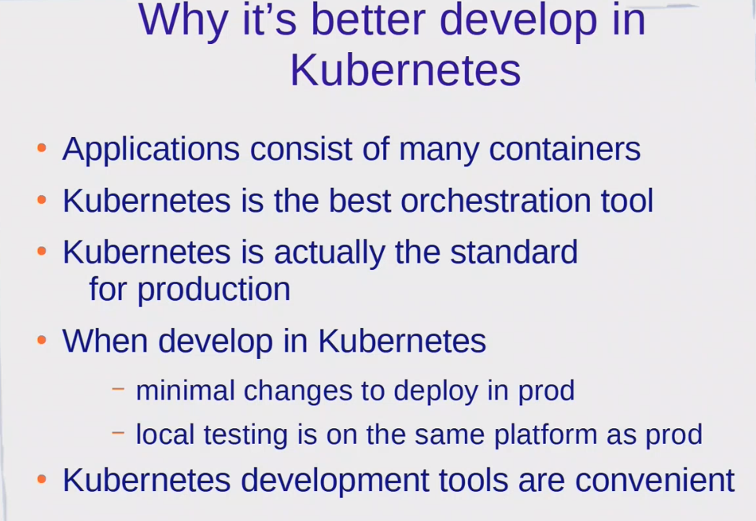
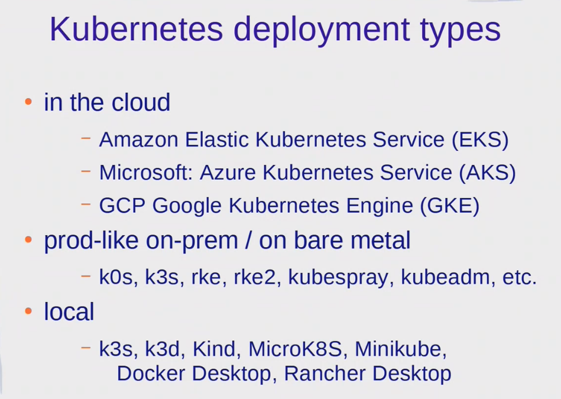

# Lesson 7 - Kubernates dev tools





### Prerequisites 

We start in terminal connected by ssh from local machine to VM with Linux

We should have installed on the VM

- Kubernetes realization `k3d` (k3s-in-Docker). If you have run Alliedium [scripts](https://github.com/Alliedium/awesome-linux-config/tree/master/manjaro#instructions) for Manjaro, `k3d` should be already installed. You can check the installation by the command

```
k3d version
```

If `k3d` is not installed, please, follow the [instruction](https://k3d.io/v5.4.6/#requirements)


- administrative command line tool `kubectl`. If you have run Alliedium [scripts](https://github.com/Alliedium/awesome-linux-config/tree/master/manjaro#instructions) for Manjaro, `kubectl` should be already installed. You can check the installation by the command

```
kubectl version
```
If `kubectl` is not installed, please, follow the [instruction](https://kubernetes.io/ru/docs/tasks/tools/install-kubectl/)


Example for Manjaro:
```
sudo pacman -Sy
sudo pacman -S --noconfirm --needed kubectl
yay -S --noconfirm --needed rancher-k3d-bin
```


- plugin manager `krew` for `kubectl`. If you have run Alliedium [scripts](https://github.com/Alliedium/awesome-linux-config/tree/master/manjaro#instructions) for Manjaro, `krew` should be already installed. You can check the installation by the command

```
kubectl krew version
```

If `krew` is not installed, please, follow the [instruction](https://krew.sigs.k8s.io/docs/user-guide/setup/install/)

See also the Lesson video from 01:03:58 

After `krew` is installed, run the command
```
kubectl krew update
```


- three plugins for kubectl installed via `krew`: 

    - `ctx` for easy change of context. To install the plugin, please, run the command  
	
	```
	kubectl krew install ctx
	```

    - `ns` for easy change of namespace.  To install the plugin, please, run the command  
	
	```
	kubectl krew install ns
	``` 

    - `konfig` for    To install the plugin, please, run the command  
	
	```
	kubectl krew install konfig
	``` 

**Remark.** At the Lesson, a separate tool `kubectx` was demonstrated, with the same functionality as the plugins `ctx` and `ns`. In this demo description, we use plugin-style commands
`kubectl ctx`, `kubectl ns` as equivalents to `kubectx` and `kubens` respectively.


At last, we should have actualized the project code. If you have already cloned the repository, run 

```
cd ~/devops-course-2022
git pull
```

otherwise clone the repository

```
mkdir ~/devops-course-2022
cd ~/devops-course-2022
git clone https://github.com/Alliedium/devops-course-2022.git
```


### Kubernates terminology


*Cluster* - A set of worker machines, called nodes, that run containerized applications. Every cluster has at least one worker node.


*Namespace* - An abstraction used by Kubernetes to support isolation of groups of resources within a single cluster.

*Context* - Cluster + user.


More here:  https://kubernetes.io/docs/reference/glossary/?all=true&fundamental=true


### Steps

1. Get the contents of the default `kubectl` configuration file

```
nano  ~/.kube/config
```

At the very beginning, the file should be empty


2. Create Kubernetes one-node cluster named `demo-cluster-1` with local container registry named `demo-registry`

```
k3d cluster create demo-cluster-1 --registry-create demo-registry:12345
```

Creation takes about one minute


3. See the cluster in the cluster list  

```
k3d cluster list
```

4. Get the contents of the default `kubectl` configuration file

```
nano  ~/.kube/config
```

At the very beginning, there should be one cluster `k3d-demo-cluster-1`, one context `k3d-demo-cluster-1`, one user. 
Take into account the `k3d-` prefix to the cluster name, which is used by `kubectl`


5. Since `k3d` is "`k3s` in Docker", let's see the containers that are used for the cluster   

```
docker ps --format "table {{.ID}}\t {{.Image}}\t {{.Ports}}\t {{.Names}}"
```

Container named `k3d-demo-cluster-1-serverlb` includes the external LoadBalancer, `k3d-demo-cluster-1-server-0` contains the cluster node, and `demo-registry` includes the local container registry created with the cluster


6. Create one more cluster

```
k3d cluster create demo-cluster-2
```

7. See the contents of the kubeconfig file

```
nano ~/.kube/config
```

There are two clusters, two contexts, two users. 
The current context points to the cluster created later: `current-context: k3d-demo-cluster-2`


8.	Get the current context by `kubectl config`

```
kubectl config current-context
```

Output: `k3d-demo-cluster-2`


9. Switch the current context by  `kubectl config`
	
```
kubectl config use-context k3d-demo-cluster-1
```

Switched to the context `k3d-demo-cluster-1`


10. Try easy context switching by `ctx` plugin command

```
kubectl ctx
```

List of two records, `k3d-demo-cluster-1`, `k3d-demo-cluster-2`, is displayed. 
You can choose a record by `<Up>` and `<Down>` arrow keys.

Choose `k3d-demo-cluster-2`, hit `<Enter>`. Switched to the context `k3d-demo-cluster-2`

```
kubectl ctx
```

Choose `k3d-demo-cluster-1`, hit `<Enter>`. Switched to the context `k3d-demo-cluster-1`


11. Get list of namespaces in the current context cluster

```
kubectl get namespaces
```

List of namespaces is displayed


12. Try easy namespace switching by `ns` plugin command

```
kubectl ns
```

List of namespaces, the same as in the previous step, is displayed. 
You can choose a record by `<Up>` and `<Down>` arrow keys.

Choose `default`, hit `<Enter>`

Output: 

```
Context "k3d-demo-cluster-1" modified.
Active namespace is "default".
```
  
13. See the modified context in the kubeconfig file

```
nano ~/.kube/config
```

Added field `namespace: default` to the context `k3d-demo-cluster-1`


14. Look for container image to deploy in Kubernetes cluster 

```
docker images
```

If there is no image `demo-multi-stage` e.g.

```
anmalai/demo-multi-stage   0.1
```

you can build it by running the following commands

```
cd ~/devops-course-2022/06_sep_2022_docker_best_practices_ii/demo-multi-stage-improved
docker build -t bkarpov/demo-multi-stage:0.1 --build-arg BASE_IMAGE=gradle:7.5.1-jdk11-alpine .
```

Finally, there should be an image `demo-multi-stage`


15. Add a tag to the image for pushing it to local container registry

```
docker tag anmalai/demo-multi-stage:0.1 localhost:12345/demo-multi-stage:0.1
```

Check that the tag has been added

```
docker images
```

There should be at least two images `demo-multi-stage`, one of them `localhost:12345/demo-multi-stage:0.1`


16. Push the image to the local container registry

```
docker push localhost:12345/demo-multi-stage:0.1
```

17. See manifest file for deploying the image to the Kubernetes cluster

```
cd ~/devops-course-2022/15_sep_2022_kubernetes_developer_tools/demo
nano ./manifest-demo-multi-stage.yaml
```

18. Apply the manifest

```
kubectl apply -f ./manifest-demo-multi-stage.yaml
```

Output:

```
namespace/demo created
deployment.apps/demo-multi-stage created
service/demo-multi-stage created
```

19. Switch to the `demo` namespace

```
kubectl ns
```

List of namespaces is displayed, with the new namespace `demo` at the bottom of the list. 

Choose `demo`, hit `<Enter>`

Output: 

```
Context "k3d-demo-cluster-1" modified.
Active namespace is "demo".
```


20. Check the pods in the active namespace

```
kubectl get pods
```

There should be at least one running pod with name starting at `demo-multi-stage-...`, the end part of the name being generated by Kubernetes


21. Check the services in the active namespace

```
kubectl get services
```

There should be at least one service named `demo-multi-stage`


22. See the logs of the pod `demo-multi-stage-...`

If there is only one such a pod, run the command

```
kubectl logs $(kubectl get pods -o name | grep demo-multi) --tail=3
``` 

Otherwise, you should use the pod name, i.e. complete name with Kubernetes-generated end part

```
kubectl logs <pod_name> --tail=3
```

The last 3 lines of the pod logs should be displayed


23. Forward the host port 7080 to the port 8080, which is listening by service 

```
k3d cluster edit demo-cluster-1 --port-add 7080:8080@loadbalancer
```

Kubernetes renames existing loadbalancer, creates a new one with ports forwarded, stops the existing one, starts the new one, and deletes the old one.  


24. See the containers that are used for the clusters   

```
docker ps --format "table {{.ID}}\t {{.Image}}\t {{.Ports}}\t {{.Names}}"
```

Container named `k3d-demo-cluster-1-serverlb` now has forwarded ports `7080->8080`


25. Test the Spring Boot application running in a container inside the pod

```
curl http://127.0.0.1:7080
```	

Output: `Greetings from Spring Boot!%` (The app is running)

SUCCESS


26. Delete the service to see that it is necessary for connect to the application

```
kubectl delete service demo-multi-stage
```

27. Test the application again

```
curl http://127.0.0.1:7080
```

Output: `curl: (52) Empty reply from server` (No connection to the app)
	

28. Restore the service by applying the manifest once again

```
kubectl apply -f ./manifest-demo-multi-stage.yaml
```

Output:

```
namespace/demo unchanged
deployment.apps/demo-multi-stage unchanged
service/demo-multi-stage created
```

29. Extract a minimal kubeconfig for the context `k3d-demo-cluster-1`

```
kubectl konfig export k3d-demo-cluster-1 > ~/.kube/k3d-demo-cluster-1.config
```

Output is written to file `~/.kube/k3d-demo-cluster-1.config`


30. See the contents of the file `~/.kube/k3d-demo-cluster-1.config`

```
nano ~/.kube/k3d-demo-cluster-1.config
```

Fix the host (VM) port of the cluster, e.g. 38857 for the following example

```
apiVersion: v1
clusters:
- cluster:
    certificate-authority-data: LS0tLS...
    server: https://0.0.0.0:46001
  name: k3d-demo-cluster
...
```


31. Logout from the VM

```
exit
```

SSH connection to the VM is closed. 
The terminal is running now on the local machine


32. Use your ssh connection data and your HOME path on the VM to copy the extracted context via ssh to the local machine.

`<ssh_connection_data>` can have the form `<login_on_VM>@<IP_address_of_VM>` e.g. `andrey@192.168.31.141`, 
or be an alias configured for connection to VM in  `~/.ssh/config`

`<HOME_path>` is the absolute path to your HOME directory on the VM, e.g. `/home/bkarpov`

```
scp andrey@192.168.31.141:/home/andrey/.kube/k3d-demo-cluster-1.config .
```

The file should be copied to the working directory on the local machine


33. Use your cluster port fixed on step 30 to forward to the VM via ssh tunnel

```
ssh -L <cluster_port>:127.0.0.1:<cluster_port> <ssh_connection_data>
```

e.g. `ssh -L 46001:127.0.0.1:46001 andrey@192.168.31.141`


34. On local machine install [VS Code](https://code.visualstudio.com/Download)


35. Open VS Code, install plugin "Kubernetes"


36. Switch to the "Kubernetes" plugin


37. Connect to the cluster on VM.

In the KUBERNETES pane, at the right hand side of the line CLUSTERS 

- click button with three dots (hint: "More Actions...")

- choose "Set Kubeconfig" in dropdown list

- choose "+ Add new kubeconfig"

- open the file saved at the Step 32

There should appear cluster `k3d-demo-cluster-1` with available Namespaces, Nods, Workloads/Deployments, Workloads/Pods, Network/Services.


38. To reproduce the example in VS Code, see the Lesson video from 01:15:26.