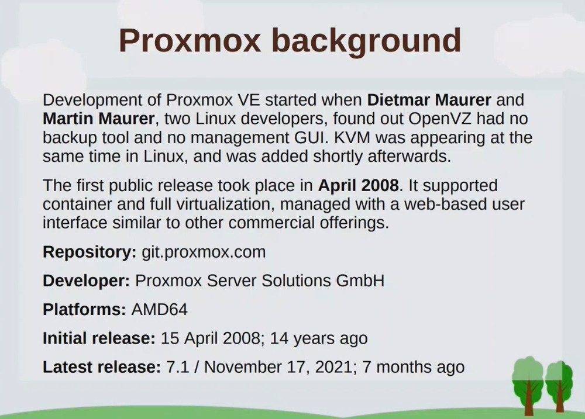

# Lesson 1 - Intro and virtualization 

**Virtualization** - In computing, virtualization is the act of creating a virtual (rather than actual) version of something at the same abstraction level, including virtual computer hardware platforms, storage devices, and computer network resources.

