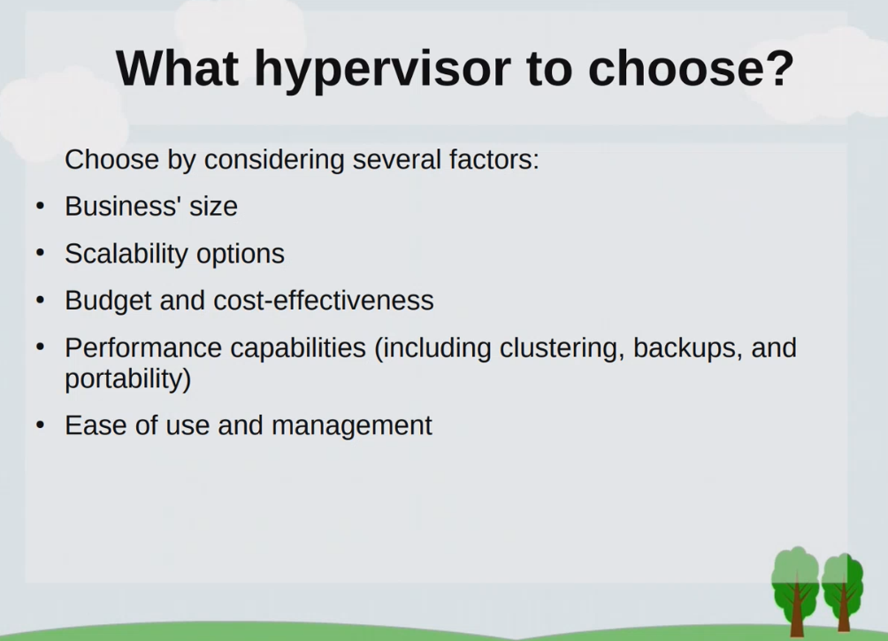
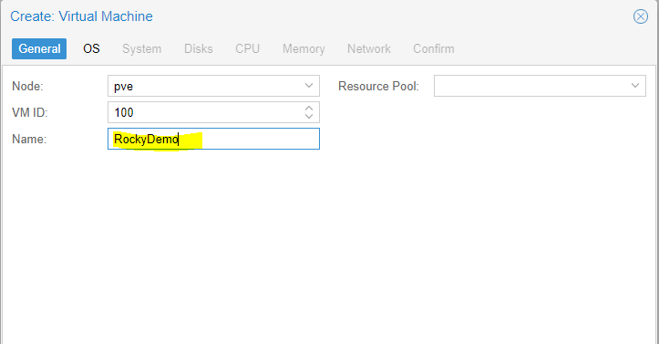
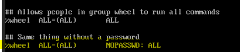

# Lesson 1 - Intro and virtualization 


**Virtualization** - In computing, virtualization is the act of creating a virtual (rather than actual) version of something at the same abstraction level, including virtual computer hardware platforms, storage devices, and computer network resources.





# Demo
1. Download Rocky from https://rockylinux.org/download/
2. Go to Proxmox and upload it


3. Right click in the node -> create VM




Storage dropdown will have either: local-zfs or local-lvm options. Looks like it depends on how the proxmox was installed. On *HardDisc Options Screen* we use ext4 for lvm or we used zfs (RAID0) - for zfs.


After that do Rocky installation
1. Set English and time and date for Chisinau
2. Software Selection -> Minimal Install
3. Installation Destination: Select "Custom" -> Done
	Select "LVM thin Provisioning" -> "Click here to create them automatically"
4. Delete "swap", extend root with some big number and click "Update Settings" 
5. For "root" - modify volume group to be alphabetically after boot, update "rl" for example to "wrl" -> Save
6. For "boot" - select ext4 and click Update; for "root" - select "LVM thin Provisioning" and ext4 - and click Update -> Click Done
7. Network & Host name -> set custom name like "rocky" and enable Ethernet
8. Create root password
9. Create user and check "Make this user admin" 
10. Wait to finish installation


# Steps inside Rocky

```sudo vi /etc/sudoers``` - and uncomment the following line (it will allow users with wheel group to use sudo without entering password each time)




```groups andrey``` - to check user groups
```usermod -aG wheel andrey``` - can run from root user to add **wheel** group to **andrey**


**Install QEMU and enable it**
```sudo dnf install -y qemu-guest-agent```

``` sudo systemctl enable --now qemu-guest-agent```