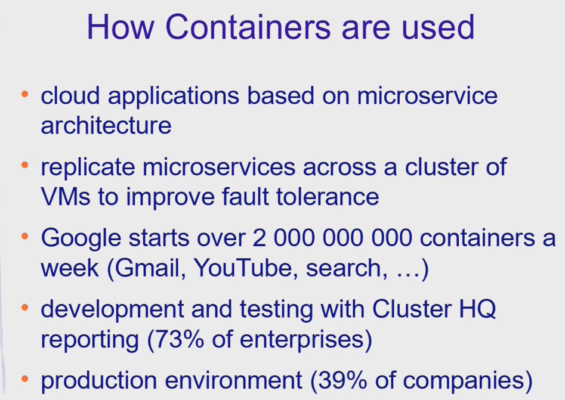
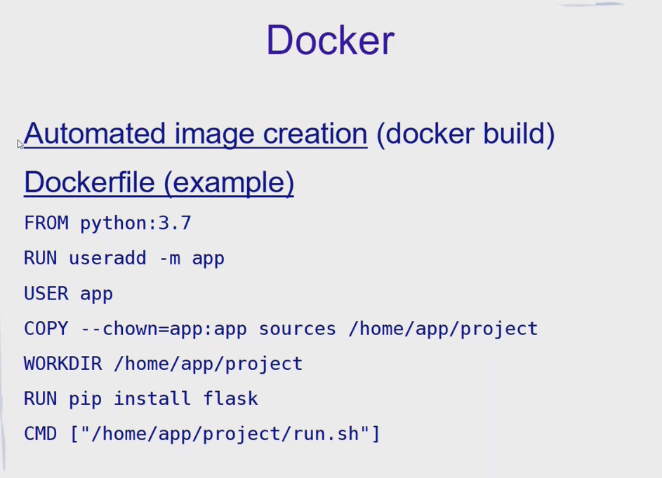

# Lesson 2 - Containers





# Demo

* NGINX Demo: https://hub.docker.com/r/nginxdemos/hello/

* Docker cheatsheet:  https://dockerlabs.collabnix.com/docker/cheatsheet/


**show docker info:**
```sudo docker info```

**create and start NEW container based on image:**
```sudo docker run --name test2 -p 80:80 -d nginxdemos/hello```  (will download image from dockerHub, run a new container "test2" and map ports 80->80)


**show containers:**
```sudo docker ps -as```

**to stop and run again:**
```sudo docker stop test1```
```sudo docker start test1```
	
**to remove container:**
```sudo docker rm test1```


**Open interactive shell for container:**
```sudo docker exec -it test1 "/bin/sh"```

See that OS and kernel version from Docker container match the ones from outer machine:


**Show images**
```sudo docker images```

**Alpine** - is a popular Linux lightweight image (minimal set of packages), many images are built on top of it
```sudo docker pull alpine:latest``` - (tag can be specified after ":", if we dont specity **latest** is used)

**Inspect Inage**
```sudo docker inspect apline```
```sudo docker inspect nginxdemos/hello```
In the Layers property we can see that **nginxdemos/hello** is based on **alpine** (hash is the same for first layer)





