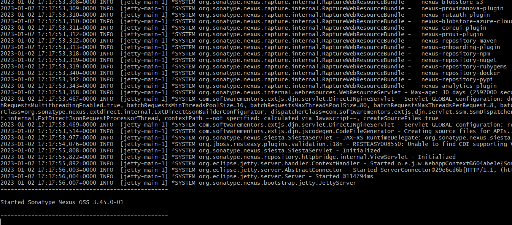

# Lesson 35 - Nexus intro


Quick install with Docker


### Quick install with Docker


```
mkdir $HOME/nexus-data && sudo chown -R 200 $HOME/nexus-data
```


```
docker run -d -p 8081:8081 -p 8182:8182 -p 8183:8183 --name nexus -e INSTALL4J_ADD_VM_PARAMS="-Xms512m -Xmx768m -XX:MaxDirectMemorySize=768m -Djava.util.prefs.userRoot=/nexus-data/javaprefs" --mount type=bind,src=$HOME/nexus-data,dst=/nexus-data --restart unless-stopped sonatype/nexus3
```


```
sudo docker logs -f nexus
```





Note: Got this error https://stackoverflow.com/questions/73023392/nexus-repo-could-not-lock-user-prefs
when using ```${NEXUS_DATA}/javaprefs```