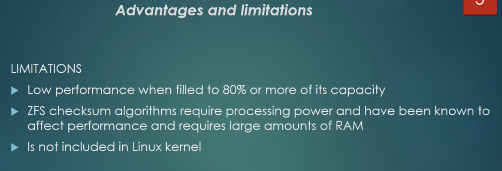

# Lesson 3 - Hyper-V, ProxMox, Zfs

1. Enable Virtualization in BIOS - chipset tab ->  VT-d in my case https://bce.berkeley.edu/enabling-virtualization-in-your-pc-bios.html
2. Windows search for **Turn Windows features on or off** - enable **Hyper-V** and **Windows Hypervisor platform** and restart
3. Run Hyper-V manager


Right click and select:


**Virtual Hard Disks** - for ex. ```D:\Hyper-V\Virtual Hard Disks\```

**Virtual Machines** - for ex. ```D:\Hyper-V\VM Configs\```


Right click and select **Virtual Switch Manager**

Select "External" -> Click "Create Virtual Switch"
Set name ex "Switch for Hyper-V" and in "External network" select your adapter -> OK


# Install Manjaro
Go to manjaro website and download image https://manjaro.org/download/


Right Click -> Create -> Virtual Machine
1. Precify name ex. MonjaroVM
2. Select Generation 2
3. StartUp memory to ex. 2048 and uncheck "Use Dynamic memory"
4. Select switch that was configured before
5. Set disk size for ex. 40 GB
6. Select image that was downloaded before
7. Next -> Finish

Right Click on machine name -> Select Settings


1. Security -> Uncheck "Enable secure boot"
2. Memory -> Set required memory
3. Processor -> set value same as our physical machine (4,8, etc)
4. Integration services -> we can uncheck "backup"
5. Checkpoints -> we can uncheck them
6. Automatic start action" -> nothing
7. Click Apply and OK

After that we can start the machine, when it loads click "Launch installer"


# Steps to enable SSH
```sudo pacman -S openssh```
```sudo systemctl enable --now sshd```
```sudo systemctl status sshd```
```sudo vi /etc/ssh/sshd_config``` -   set **PasswordAuthentication** yes  and save it
```sudo systemctl restart sshd```

if user has no "wheel" group, we can run this from root user: ```usermod -aG wheel andrey```


```ip a``` - will show ip address and we can connect via SSH


Now we should be able to connect from another machine:


# Proxmox install
Go to and download ISO: https://www.proxmox.com/en/downloads
 
Steps are the same as for Manjaro, just we need to allocate more resources
Before starting ProxMox - we need to enable Nested Virtualization

Open Windows PowerShell and run
```Set-VMProcessor -VMName Proxmox -ExposeVirtualizationExtensions $true``` - where "Proxmox" is the name you give to the ProxMox machine


We start the machine and begin ProxMox installation
1. I agree
2. Target Hard disk -> Click Options -> Select **ext4** or **zfs (RAID0)** -  we select which filesystem will be used for OS. Read about "ZFS on root" 
3. Set password and email
4. Hostname -> Set pve.loc
5. Click Install


After that ProxMox should show that web interface is available now:


Open it in browser

Select **Shell** and we can login as username ```root``` and password - that we set during ProxMox install


**Configure packages updates**

Configure free updates channel:
```vi /etc/apt/sources.list.d/pve-enterprise.list```
and comment that one line

```vi /etc/apt/sources.list```   
and add line:     
```deb http://download.proxmox.com/debian/pve bullseye pve-no-subscription```

and run ```apt update``` and ```apt upgrade```


Now we can create new VMs inside ProxMox
One more important step to be able to have Internet ascess from VMs created inside ProxMox:


# ZFS





