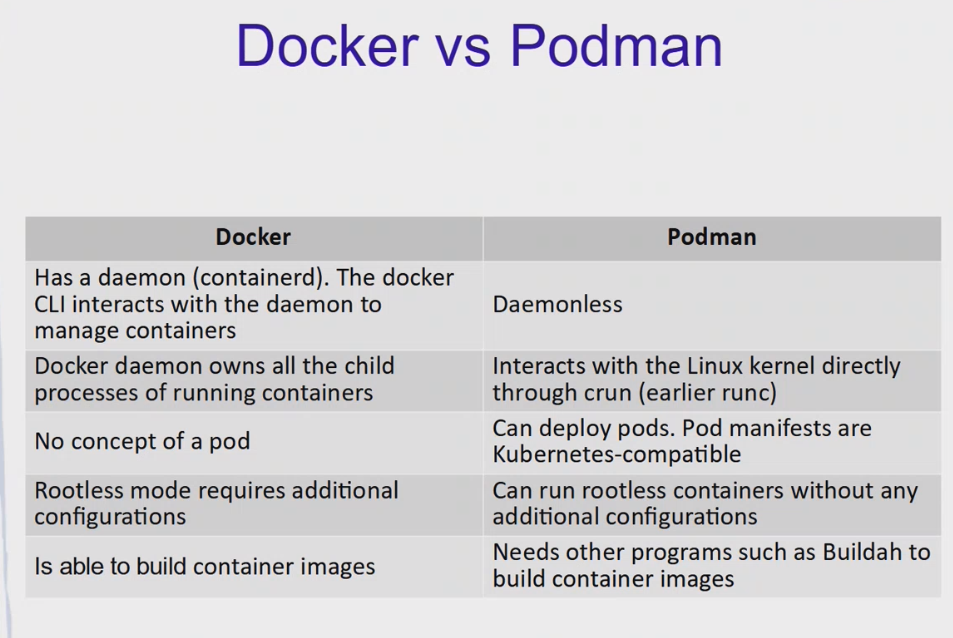

# Lesson 4 - Containers


* FROM - shows the image and tag to start from
* ```RUN useradd -m app``` - create user *app* with home directory inside image
* ```USER app``` - change user to *app*
* ```COPY -chown=app:app sources /home/app/project``` - copy files from *sources* folder (which sits next to docker build file) inside container with destination */home/app/project*. And that folder owner will be user *app*
* ```WORKDIR /home/app/project``` - change working directory
* ```RUN pip install flask``` - run command during image build
* ```CMD ["/home/app/project/run.sh"]``` - run command inside container

Note that **RUN** is executed during image build process and **CMD** is executed when container is started.


**References:**

https://docs.docker.com/build/hellobuild/

https://docs.docker.com/engine/reference/builder/




