# Lesson 4 - Zfs


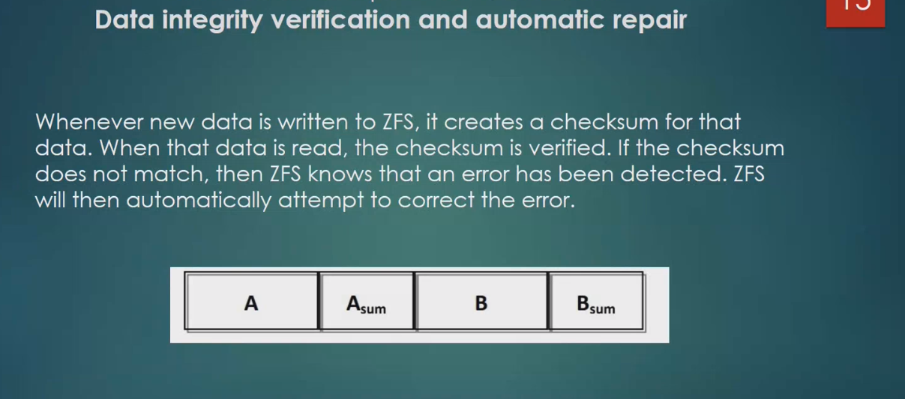
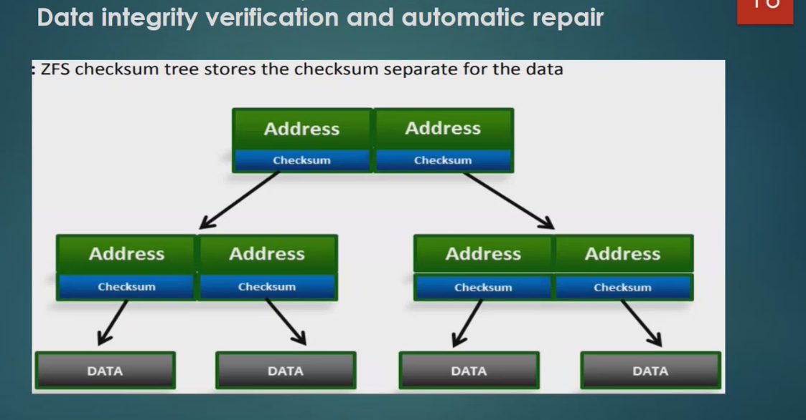
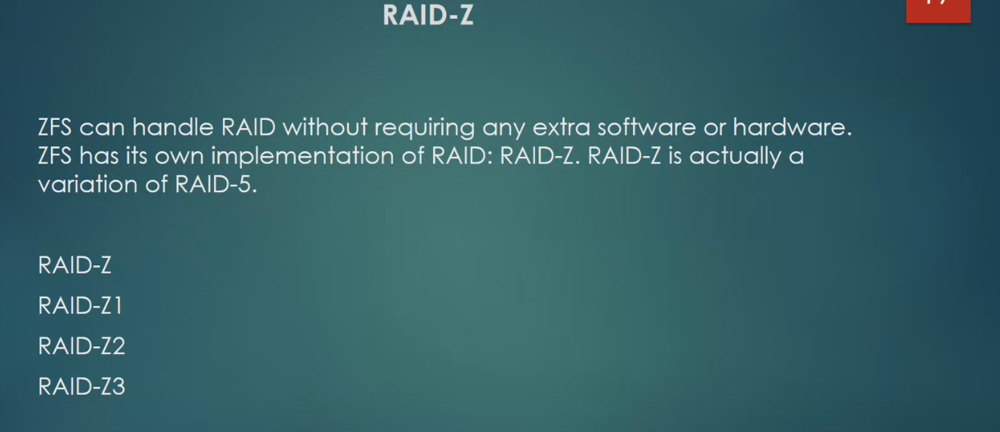

* Recomended is to use RAID-1 or RAID-10


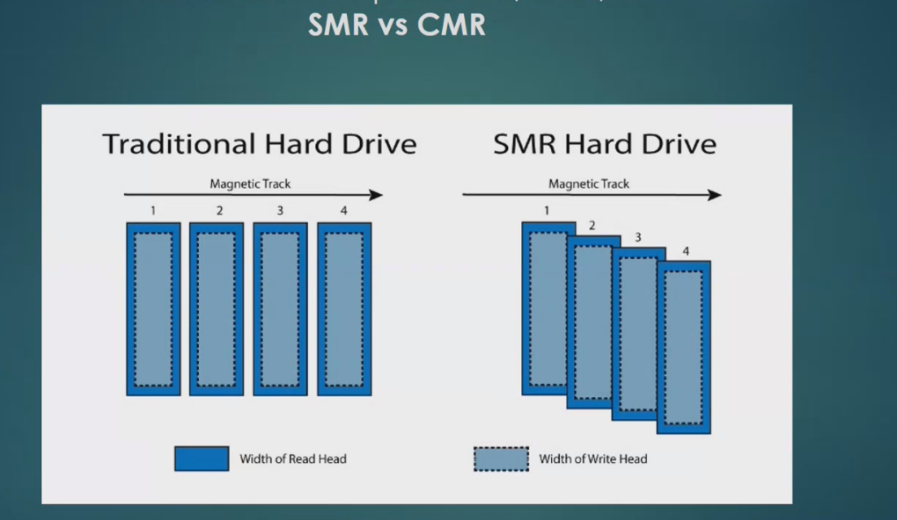
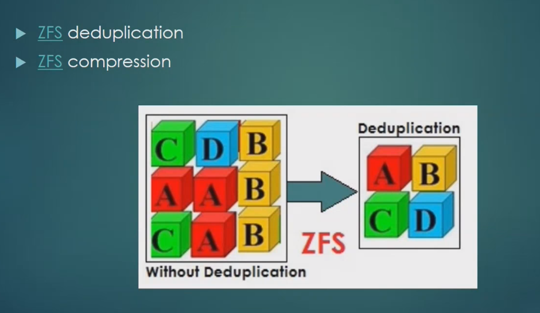
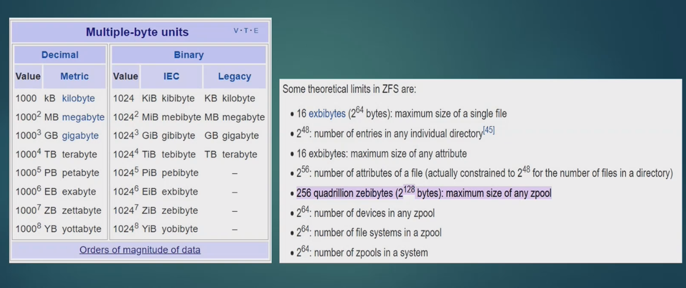


# RAID 10 pool

Lets add 4 disks 2 GB each to the ProxMox machine:

ProxMox -> Settings -> SCSI Controller -> Select "Hard Drive" -> Click "Add"
-> Click "New" and proceed with next steps. 

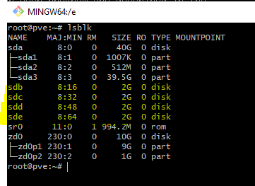


We will create **RAID10** pool
	
```
zpool create mypool mirror /dev/sdb /dev/sdc mirror /dev/sdd /dev/sde
```
```
zpool list
```
			
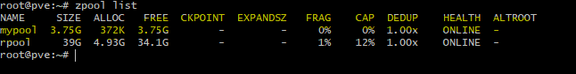


We can also execute:
```zpool status mypool```


# DataSets


When we create pool - filesystem will automatically create a root dataset. In our case ```/mypool``` and will mount it in the root folder of the system. 

To view the datasets:
```
zfs list
```

We can create any files and directories inside it.
			
```
touch /mypool/file1
touch /mypool1/file2
```

			
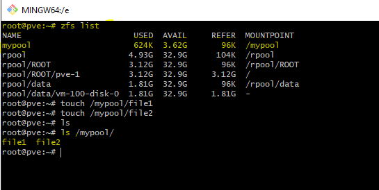
			
also, we can create other datasets inside it:

```
zfs create mypool/data
```

	
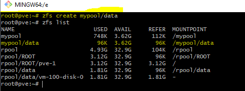
	
			
Inside these inner datasets we can also create files. Dataset looks like a regular directory. However, dataset cannot be placed into a regular directory. Datasets make possible to create filesystem snapshots. We can see datasets using command ```zfs list```

Lets take one dataset and create file inside:				
					
```
dd if=/dev/urandom of=/mypool/data/file1 bs=1M count=100
```
					

And create a snapshot:
```
zfs snapshot mypool/data@snap1
```
					
This command will create a special dataset available only for read, which cannot be changed. It will hold a copy of **mypool/data**.
To see it in the list use:

```
zfs list -t all
```
												
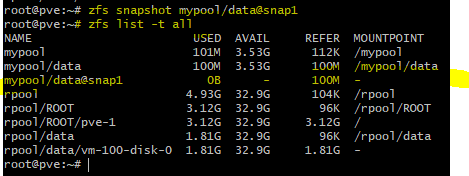


There is no actual data being copied in the moment snapshot is created. The only thing that is copied is metadata about the files and blocks of which the source dataset consists.
					

Lets create one more file:

```
dd if=/dev/urandom of=/mypool/data/file2 bs=1M count=200
```
					
And delete file *mypool/data/file1*	
				
```
rm /mypool/data/file1
```
						
```
zfs list -t all
```


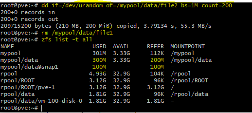

Now we see that snapshot has the size of the file that we deleted (100M). Snapshots are available as directories of this dataset.
						
```
ls /mypool/data/.zfs/snapshot/snap1
```


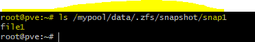


We can copy the deleted file into a new place. Or we can restore dataset state from any snapshot.

```
zfs rollback mypool/data@snap1
```

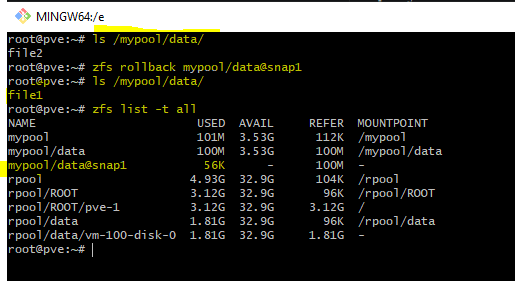

As we can see, **file2** (that was created after the snapshot was made) was deleted, but **file1** that was a part of snapshot and deleted afterwards - now was restored.
		
		
		
		
		
# Attributes				

Attributes define in which mode filesystem will work
		
```
zfs get all
```
		
Some attributes cannot be changed. Attributes are inherited by child datasets, but they can be overridden.					


			
# Quota

Is a limitation of disk storage to be used. To set quota for a specific dataset- we need to set attribute.
	
```
zfs set quota=500M mypool
zfs get quota mypool
```
					
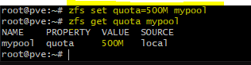
						

This limitation is applied to all datasets in sum. And relates to real size on the disk.
Lets try to write a file into dataset: (note that currently we use 101M, use ```zpool list mypool``` to check)

```
dd if=/dev/urandom of=/mypool/data/file3 bs=1M count=500
```
					
					
We get an error saying that quota of 500M was exceeded. 
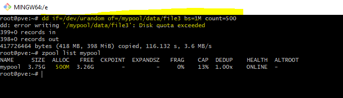
					
					

					
# Data deduplication
			
Different users can copy files into different locations. And each time a new block of data is created, filesystem can verify if it already exists somewhere in the system.
If it exists - it can be reused using a pointer. To be able to do it - filesystem stores a hashTable of all the blocks and uses it to find duplicates.


To activate deduplication:
					
```
zfs set dedup=on mypool
zfs get dedup mypool
```
					
Lets create a simple text file

```date > /mypool/test```  and make 4 copies of it:

```
cp /mypool/test /mypool/test1
cp /mypool/test /mypool/test2
cp /mypool/test /mypool/test3
cp /mypool/test /mypool/test4
```


Lets view the result:

```
zpool list mypool
```
			
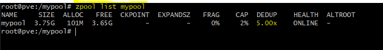


# Data compression

Lets delete the pool and create new one:
				
```
zpool destroy mypool
zpool create mypool mirror /dev/sdb /dev/sdc mirror /dev/sdd /dev/sde
```

And create inner dataset:
```
zfs create mypool/data
```
					

Lets show the attributes related to compression:
					
```
zfs get compression mypool
zfs get compression mypool/data
```
	
	
Lets set the compression attribute:

```
zfs set compression=zstd mypool
```
						
Now both **mypool** and **mypool/data** will have compression = zstd


Lets create a text file: (with repeating text)
						
```
vi /mypool/data/text
```
	

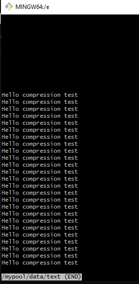
					

And check the value of compression:
				
```
zfs get compressratio mypool
zfs get compressratio mypool/data
```
						
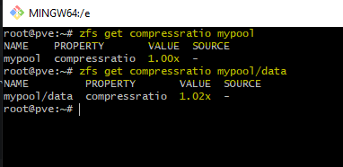