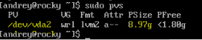
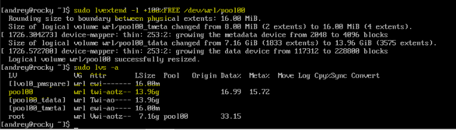

# Lesson 6 - Disk resize, ssh, backup

Демо на Disk Resize


### LVM Thin Provisioning ###
Prerequisites: root partition should be the last by order (though there is possibility to resize independent on partition order, this example does it for the simple case).
discard checkbox should be checked (for fstrim usage).
*lsblk* lists information about all available or the specified block devices. The command prints all block devices (except RAM disks) in a tree-like format by default.

```
lsblk
```


Resize disk in Proxmox UI: Hard Disk > Disk Action > Resize.
And add 5G


We see that overall we now have 15G, but they were not added, but our vda1 and vda2 still have old sizes. 


Install growpart:

```
sudo dnf install -y cloud-utils-growpart
```
Check info in the partitions table.
```
sudo fdisk -l
```
Check block devices details.
```
lsblk
```

Resize partition:
```
sudo growpart /dev/vda 2
```
```
lsblk
```

Now we have 14G for vda2


```
sudo fdisk -l
```
```
sudo lvs
```
```
df -hT
```


Resize physical volume:
```
sudo pvs
```




```
sudo pvresize /dev/vda2
```
```
sudo pvs
```


```
sudo vgs
```


Resize pool:

```
sudo lvdisplay
```
```
sudo lvextend -l +100%FREE /dev/wrl/pool00
```
```
sudo lvs -a
```




Resize root:
```
sudo lvextend -L 13.96g /dev/wrl/root
```


Resize file system:
```
sudo resize2fs /dev/wrl/root
```


Go to the node's shell (ProxMox) & check VM size and data percentage: 
```
lvs -a     # or zfs list (if proxmox uses zfs)
lvs -a | grep vm-<id>-disk
```


See *rpool/data/vm-100-disk-0*


Go back into VM and run command to create a file which would consume 2G:
```
dd if=/dev/urandom of=image.crypted bs=1M count=2048
```


Check percentage of used has increased in the VM:
```
df -h
```


Check percentage of used has increased on the node level:
```
lvs -a | grep vm-<id>-disk  # or zfs list (if proxmox uses zfs)
```


Go back into VM and run command to remove the file:
```
rm image.crypted
```

Check percentage of used has decreased in the VM:
```
df -h
```


Check percentage of used is the same on the node level:
```
lvs -a | grep vm-<id>-disk  # or zfs list (if proxmox uses zfs)
```


We still have the old value 


Go back to VM console and run command to discard blocks which are not used by filesystem:
```
sudo fstrim -a -v
```

Check percentage of used has decreased on the node level:
```
lvs -a | grep vm-<id>-disk # or zfs list (if proxmox uses zfs)
```


### no LVM (Standard partition) ###
Prerequisites: root partition should be the last by order.

Check actual state:
```
df -hT
```
Resize disk in Proxmox UI: Hard Disk > Disk Action > Resize
```
df -hT
```
Resize partition:
```
sudo growpart /dev/vda 2
```
```
lsblk
```
Resize file system:
```
sudo resize2fs /dev/vda2
```