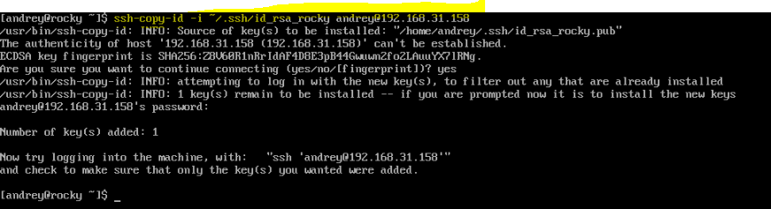
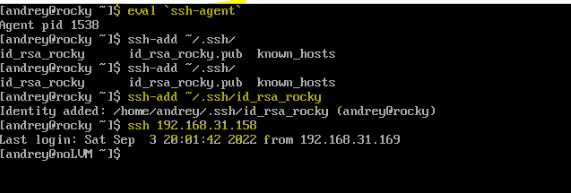
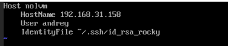

# Lesson 6 - SSH


### via ssh agent ###

Check actual state of sshd:
```
sudo systemctl status sshd
```

Generate ssh keys
```
ssh-keygen
```


Send public key to the machine we want to access:
```
ssh-copy-id -i <path> <user>@<ip>
```





1. Enter with password:
```
ssh <user>@<ip>
```


2. Enter with key:
```
ssh -i <path> <user>@<ip>
```


3. Enter using agent: (configuration is stored in RAM, same terminal - not persistent)

Run agent:
```
eval `ssh-agent`
```

Add user identity:
```
ssh-add <path>
```

Access the machine:
```
ssh <ip>
```




Show ssh agent keys:
```
ssh-add -l
```


### via alias from config file ###

Add entry to config file:
```
sudo vi ~/.ssh/config
```
as following:
Host <alias>
    HostName <ip of the machine we are going to access>
    User <user>
    IdentityFile <path>

Save.


Check you can access the VM


```
ssh <alias>
```


Also, we can deny the password authentication to the target machine by editing the 
*/etc/ssh/sshd_config*


and set the: 

```PasswordAuthentication no```

``` PublickeyAuthentication yes ```  (this looks like in any case is enabled by default)
