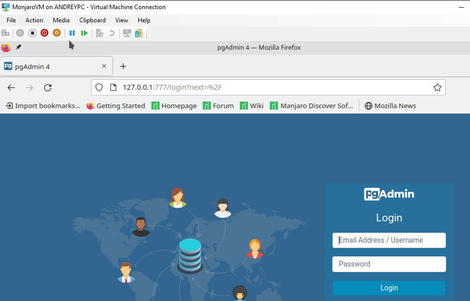
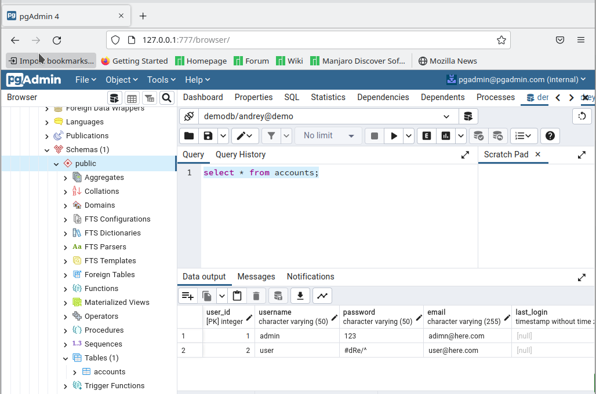

# Lesson 7 - Docker


### Example 1: Simple Spring Boot application in a container with multi-stage build ###


To perform the Steps 15-17,
 
- you should have an account on Dockerhub https://hub.docker.com/

- on Step 5 you have to tag the image as `<your_Dockerhub_login>/demo-multi-stage:0.1` instead of `bkarpov/demo-multi-stage:0.1` 


1. Get the project code. 

```
git clone https://github.com/Alliedium/devops-course-2022.git
```


2. Get docker disk usage

```
docker system df
``` 

Suppose the system to be clean: all values are 0.


3. Change to the project directory

```
cd ./devops-course-2022/30_aug_2022_docker_best_practices_i/demo-multi-stage
```

4. See the Dockerfile contents

```
vi Dockerfile
```

Two `FROM` instructions define two build stages. On the first stage of the source code is copied from the context to the first stage file system and then compiled. 
The second stage takes from the first stage only the compilation result. 

Quit the editor


5. Build the image. If you have an account on Dockerhub, use the tag `<your_Dockerhub_login>/demo-multi-stage:0.1`

```
docker build -t anmalai/demo-multi-stage:0.1 --build-arg BASE_IMAGE=gradle:7.5.1-jdk11-alpine .
```

The build process takes about two minutes. The image contains only the layers of the second stage. The layers of the first stage are put in build cache.   


6. Get list of images

```
docker images
```

Image `anmalai/demo-multi-stage:0.1` of size 176 MB is in the list


7. Get docker disk usage

```
docker system df
```

If the docker system was clean on Step 2, the output would be the following: 


Otherwise, the output values are added to the corresponding values received on Step 2


8. Build another image with the same Dockerfile and context

```
docker build -t anmalai/demo-multi-stage:0.2 --build-arg BASE_IMAGE=gradle:7.5.1-jdk11-alpine .
```

The build process takes a few seconds. 


9. Get list of images

```
docker images
```

Images `anmalai/demo-multi-stage:0.1` and `anmalai/demo-multi-stage:0.2` have the same Image ID.  


10. Remove the another image

```
docker rmi anmalai/demo-multi-stage:0.2
```

Only tag `0.2` has been removed, not the image: `Untagged: anmalai/demo-multi-stage:0.2`


11. Get list of images

```
docker images
```

Image `anmalai/demo-multi-stage:0.1` is still present in the list


12. Create and run a container based on the image `anmalai/demo-multi-stage:0.1`. Map the host port 7080 to the container port 8080

```
docker run -d -p 7080:8080 anmalai/demo-multi-stage:0.1
```

Output: `<CONTAINER_ID>` (Container is created and running)


13. Connect to the application running in the container from the host

```
curl localhost:7080
```

Output: `Greetings from Spring Boot!%` (The app is running) 


14. The default Container Registry for Docker is Dockerhub (https://hub.docker.com/)

To perform the next three Steps
 
- you should have an account on Dockerhub

- you have to tag the image to be pushed as `<your_Dockerhub_login>/demo-multi-stage:0.1`


https://docs.docker.com/docker-hub/repos/#pushing-a-docker-container-image-to-docker-hub

Note- he already have the correct tag that we specified using the ```-t anmalai/demo-multi-stage:0.1```


15. Log in to the default Container Registry (Dockerhub)

```
docker login
```

16. Push the image to the Container Registry

```
docker push <your_Dockerhub_login>/demo-multi-stage:0.1
```

Only two layers are pushed, the others are mounted from the Registry


17. Log out from the Container Registry

```
docker logout
```

18. Clean the docker system

```
docker stop <initial_part_of_CONTAINER_ID>
docker rm <initial_part_of_CONTAINER_ID>
docker rmi anmalai/demo-multi-stage:0.1
docker builder prune
```


### Example 2: pgAdmin in a container ###

19. Change to Home directory

```
cd ~
```


20. Make an empty folder for storing pgAdmin data

```
mkdir ~/.pgadmin
```


21. Get the Linux access permissions to the `~/.pgadmin` directory

```
ls -ld ~/.pgadmin
```


22. Get the ACL permissions to the  `~/.pgadmin` directory

```
getfacl ~/.pgadmin
```

No additional permissions with respect to Linux access permissions


23. Set ACL permissions for current user and its primary group 

```
setfacl -Rm u:andrey:rwX ~/.pgadmin
setfacl -Rm g:andrey:rwX ~/.pgadmin

setfacl -Rdm u:andrey:rwX ~/.pgadmin
setfacl -Rdm g:andrey:rwX ~/.pgadmin
```


24. Change the owner of the  `~/.pgadmin` directory to the pgAdmin's user and its primary group

```
sudo chown -R 5050:5050 ~/.pgadmin
```


25. Get the Linux access permissions to the `~/.pgadmin` directory

```
ls -ld ~/.pgadmin
```

The user owner and group owner changed to `5050`

There appear `@` sign after the `r-x` for others 


26. Get the ACL permissions to the `~/.pgadmin` directory

```
getfacl ~/.pgadmin
```


27. Create and start a container based on image  `dpage/pgadmin4:latest`, in host network, listening port 777, and with the folder `~/.pgadmin` mapped to `/var/lib/pgadmin` inside the container 

```
docker run \
--name pgadmin4 \
--net=host \
--mount "type=bind,source=$HOME/.pgadmin,target=/var/lib/pgadmin" \
 -e "PGADMIN_LISTEN_PORT=777" \
 -e "PGADMIN_DEFAULT_EMAIL=pgadmin@pgadmin.com" \
-e "PGADMIN_DEFAULT_PASSWORD=123" \
-d \
dpage/pgadmin4
```


28. See the container logs in realtime

```
docker logs -f pgadmin4
```

Wait until the service started i.e. a message appear `Booting worker with pid:...`

```
Hit <Ctrl+C>
```


29. Ensure that the container with the name `pgadmin4` has Status `Up` 

```
docker ps
```


30. Create and start a new container with PostgerSQL service with database directory mounted in the host file system. S

```
docker run \
    --name demo-postgres \
    -e POSTGRES_USER=andrey \
    -e POSTGRES_PASSWORD=demopassword \
    -e PGDATA=/var/lib/postgresql/data \
    -e POSTGRES_DB=demodb \
    -p 6432:5432 \
    --mount 'type=bind,source=/home/andrey/pgdata,target=/var/lib/postgresql/data' \
    -d \
    postgres:14.5-alpine3.16
```	


31. Ensure that the container with the name `demo-postgres` has Status `Up` 

```
docker ps
```


Now, you can connect to your VM by port 777 to see pgAdmin web interface. 


32. In another Bash (GitBash) window on your local machine, open SSH tunnel to your VM 

```
ssh -L 888:127.0.0.1:777 <user_name>@<IP_address_of_your_VM>
```

Type your password

33. In browser on your local machine, open the URL 

```
http://localhost:888
```

Login screen will be displayed. 

34. Or from the machine on which you are running Docker (if it has browser) you can access

```
http://127.0.0.1:777
```




35. Login to pgAdmin. Type login `pgadmin@pgadmin.com` and password `123` as set in Step 27.

pgAdmin web interface will be opened


36. Add new server with connections    


37. And we can execute query to get rows that we inserted previously
